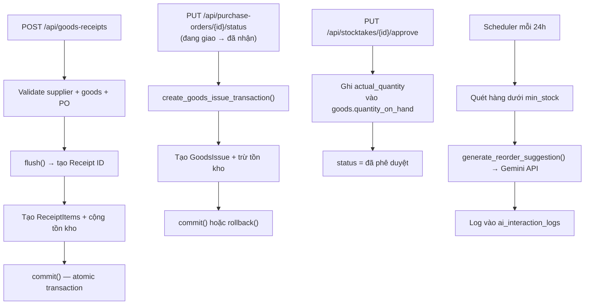

# Kiểm tra AI Module & API Routers — Warehouse AI System

## 📁 Cấu trúc tổng quan

```
backend/app/
├── ai/
│   ├── __init__.py
│   ├── inventory_report_service.py
│   ├── reorder_suggestion_service.py
│   ├── scheduler.py
│   └── prompts/
│       └── inventory_prompts.py
└── routers/
    ├── ai_features.py
    ├── buyer_portal.py
    ├── categories.py
    ├── goods.py
    ├── goods_issues.py
    ├── goods_receipts.py
    ├── purchase_orders.py
    ├── reports.py
    ├── stocktakes.py
    ├── supplier_invoices.py
    ├── supplier_portal.py
    ├── suppliers.py
    └── users.py
```

---

## 🤖 Module AI (`app/ai/`)

### 1. `inventory_report_service.py` — Sinh báo cáo tồn kho

| Thành phần | Chi tiết |
|---|---|
| **Model AI** | `gemini-1.5-flash` (đọc từ env `AI_MODEL`) |
| **API Provider** | Google Generative Language API (`generativelanguage.googleapis.com/v1beta`) |
| **Auth** | `GEMINI_API_KEY` từ env |
| **Response format** | `application/json` (yêu cầu Gemini trả JSON thô) |
| **Hàm chính** | `generate_inventory_report(inventory_data, user_id)` |
| **Log DB** | Ghi vào `ai_interaction_logs` với `feature_type="inventory_report"` |

**Payload gửi Gemini:**
```json
{
  "system_instruction": { "parts": [{"text": "..."}] },
  "contents": [{"role": "user", "parts": [{"text": "..."}]}],
  "generationConfig": { "response_mime_type": "application/json" }
}
```

**Response JSON mong đợi:**
```json
{
  "summary": "...",
  "low_stock_items": [{"sku": "...", "current_qty": 0, "min_stock": 0}],
  "notable_changes": [{"sku": "...", "note": "..."}]
}
```

---

### 2. `reorder_suggestion_service.py` — Gợi ý nhập hàng

| Thành phần | Chi tiết |
|---|---|
| **Hàm chính** | `generate_reorder_suggestion(reorder_data, user_id)` |
| **API core** | Tái dùng `_call_gemini_api()` từ `inventory_report_service` |
| **Log DB** | `feature_type="reorder_suggestion"` |

**Response JSON mong đợi:**
```json
{
  "reorder_suggestions": [
    {"sku": "...", "suggested_quantity": 0, "reason": "..."}
  ]
}
```

---

### 3. `scheduler.py` — Tác vụ nền định kỳ (APScheduler)

| Thành phần | Chi tiết |
|---|---|
| **Thư viện** | `APScheduler` (`BackgroundScheduler`) |
| **Trigger** | `interval` — mỗi **24 giờ** |
| **Job ID** | `check_low_stock_job` |
| **Chức năng** | Quét hàng active có `quantity_on_hand < min_stock` → gọi AI gợi ý nhập hàng |
| **Guard** | `replace_existing=True` + guard `_scheduler.running` để tránh conflict khi reload |

---

### 4. `prompts/inventory_prompts.py` — System & User Prompts

| Biến | Dùng cho |
|---|---|
| `SYSTEM_PROMPT_INVENTORY` | Báo cáo tồn kho |
| `USER_PROMPT_INVENTORY` | Template user prompt nhận `{inventory_report}` |
| `SYSTEM_PROMPT_REORDER` | Gợi ý nhập hàng |
| `USER_PROMPT_REORDER` | Template user prompt nhận `{reorder_data}` |

> **Lưu ý:** Prompt yêu cầu AI trả JSON thô (không bọc markdown ` ```json ``` `), phù hợp với `response_mime_type: application/json`.

---

## 🌐 API Routers (`app/routers/`)

### Bảng tổng hợp toàn bộ endpoints

| Router file | Blueprint | Prefix | Endpoints |
|---|---|---|---|
| `ai_features.py` | `ai_features_bp` | `/api/ai` | POST `/inventory-report`, POST `/reorder-suggestion` |
| `goods.py` | `goods_bp` | `/api/goods` | GET, POST `/`, GET + PUT `/{id}`, GET `/low-stock` |
| `suppliers.py` | `suppliers_bp` | `/api/suppliers` | GET, POST `/`, GET + PUT + DELETE `/{id}` |
| `goods_receipts.py` | `goods_receipts_bp` | `/api/goods-receipts` | GET, POST `/`, GET `/{id}` |
| `goods_issues.py` | `goods_issues_bp` | `/api/goods-issues` | GET, POST `/`, GET `/{id}` |
| `purchase_orders.py` | `bp` | `/api/purchase-orders` | GET, POST `/`, GET `/{id}`, PUT `/{id}/status` |
| `stocktakes.py` | `stocktakes_bp` | `/api/stocktakes` | GET, POST `/`, PUT `/{id}/propose`, PUT `/{id}/approve` |
| `supplier_invoices.py` | `supplier_invoices_bp` | `/api/supplier-invoices` | GET, POST `/`, GET `/{id}` |
| `supplier_invoices.py` | `supplier_payments_bp` | `/api/supplier-payments` | POST `/` |
| `reports.py` | `reports_bp` | `/api/reports` | GET `/inventory-value`, GET `/turnover`, GET `/top-goods`, GET `/stocktake-diff` |
| `categories.py` | `categories_bp` | `/api/categories` | GET, POST `/`, GET + PUT `/{id}` |
| `users.py` | `users_bp` | `/api/users` | GET, POST `/`, GET + PUT + DELETE `/{id}` |
| `buyer_portal.py` | `buyer_portal_bp` | `/api/buyer-portal` | GET `/buyers`, GET `/catalog`, POST + GET `/requests`, POST `/requests/{id}/confirm` |
| `supplier_portal.py` | `supplier_portal_bp` | `/api/supplier-portal` | GET `/suppliers`, POST `/login`, GET `/catalog`, POST + GET `/offers` |

---

### Chi tiết phân quyền (role-based)

| Endpoint nhóm | admin | warehouse_manager | warehouse_keeper | supplier | public |
|---|:---:|:---:|:---:|:---:|:---:|
| AI: inventory-report | ✅ | ✅ | ❌ | ❌ | ❌ |
| AI: reorder-suggestion | ✅ | ✅ | ✅ | ❌ | ❌ |
| Suppliers: GET list | ✅ | ✅ | ❌ | ❌ | ❌ |
| Suppliers: GET detail | ✅ | ✅ | ✅ | ❌ | ❌ |
| Suppliers: DELETE | ✅ | ❌ | ❌ | ❌ | ❌ |
| Goods Receipts: POST | ✅ | ❌ | ✅ | ❌ | ❌ |
| Purchase Orders: PUT status | ✅ | ❌ | ✅ | ❌ | ❌ |
| Reports | ✅ | ✅ | ❌ | ❌ | ❌ |
| Stocktake: approve | ✅ | ✅ | ❌ | ❌ | ❌ |
| Users: tất cả | ✅ | ❌ | ❌ | ❌ | ❌ |
| Buyer Portal: catalog, buyers | ❌ | ❌ | ❌ | ❌ | ✅ |
| Buyer Portal: POST request | ❌ | ❌ | ❌ | ❌ | ✅ |
| Supplier Portal: login | ❌ | ❌ | ❌ | ❌ | ✅ |

---

### Luồng nghiệp vụ đặc biệt



---

## ⚠️ Các vấn đề cần lưu ý

### 🔴 Vấn đề nghiêm trọng

1. **`categories.py` — `_find_duplicate_name` tải toàn bộ bảng**
   - `Category.query.all()` rồi loop Python để so sánh case-insensitive
   - **Hậu quả**: khi có nhiều danh mục sẽ slow, không dùng index DB
   - **Sửa**: dùng `.ilike(name)` như pattern đã có ở `suppliers.py`

2. **`purchase_orders.py` — Tên blueprint không nhất quán**
   - Blueprint đặt tên `bp` thay vì `purchase_orders_bp`
   - Có thể gây nhầm lẫn khi đăng ký trong `main.py`

3. **`buyer_portal.py` — `list_buyers()` trả danh sách hardcode**
   - Danh sách 10 công ty được hardcode, không lấy từ DB
   - Không phù hợp với production

### 🟡 Vấn đề cần cải thiện

4. **AI: `prompt_input` bị cắt tại 500 ký tự**
   - Chỉ log 500 ký tự đầu, có thể mất context quan trọng khi debug

5. **`goods_receipts.py` — Exception handler nuốt lỗi**
   - `except Exception as e: ... rollback` nhưng không log `e` → khó debug production

6. **`supplier_portal.py` — Xác thực NCC bằng số điện thoại**
   - Authentication chỉ dùng `supplier_id + phone` (không có password hash)
   - Bảo mật yếu nếu số điện thoại NCC bị lộ

7. **AI: Không có retry/timeout fallback**
   - `_call_gemini_api` timeout=30s nhưng không retry
   - Nếu Gemini trả lỗi tạm thời → endpoint trả 500 ngay

### 🟢 Điểm tốt

- ✅ Tất cả endpoint nghiệp vụ đều dùng JWT + role decorator
- ✅ Transaction integrity nhất quán (flush → commit → rollback)
- ✅ Soft-delete cho suppliers và users (không xóa vật lý)
- ✅ AI log đầy đủ vào DB với `feature_type`, `model_used`, `user_id`
- ✅ Scheduler có guard chống `SchedulerAlreadyRunningError`
- ✅ Response lỗi chuẩn `{"error_code": "...", "message": "..."}`
- ✅ Prompts tách file riêng, dễ bảo trì
