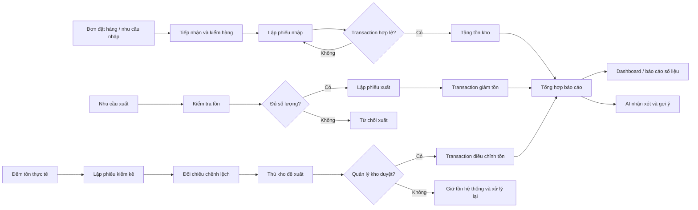

# Phân tích quy trình nhập kho, xuất kho, kiểm kê và báo cáo tồn

## 1. Phạm vi và nguyên tắc chung

Tài liệu mô tả các quy trình nghiệp vụ cốt lõi của hệ thống quản lý kho có tích hợp AI:

- Nhập hàng từ nhà cung cấp và ghi nhận tăng tồn.
- Xuất hàng khỏi kho và ghi nhận giảm tồn.
- Kiểm kê thực tế, xử lý chênh lệch và cập nhật tồn sau phê duyệt.
- Tổng hợp số liệu nhập - xuất - tồn và sử dụng AI để nhận xét, gợi ý.

AI chỉ hỗ trợ phân tích và trình bày thông tin. AI không được tự tạo số liệu, tự tạo phiếu hoặc tự động thay đổi tồn kho. Khi dịch vụ AI không hoạt động, các nghiệp vụ nhập, xuất, kiểm kê và báo cáo số liệu gốc vẫn phải sử dụng được.

### 1.1. Vai trò

| Vai trò | Trách nhiệm trong các quy trình |
|---|---|
| Thủ kho | Tiếp nhận hàng, lập phiếu nhập/xuất, đếm hàng, lập phiếu kiểm kê và đề xuất xử lý chênh lệch |
| Quản lý kho | Phê duyệt xử lý chênh lệch kiểm kê, theo dõi tồn và xem báo cáo |
| Ban điều hành | Xem báo cáo tổng hợp, theo dõi hiệu quả và cấu hình ngưỡng tồn |
| Nhà cung cấp | Giao hàng theo đơn đặt hàng; không trực tiếp đăng nhập hệ thống |

### 1.2. Nguyên tắc dữ liệu

- `goods.quantity_on_hand` chỉ được thay đổi trong transaction của nghiệp vụ nhập, xuất hoặc kiểm kê đã được phê duyệt.
- Không cho phép tồn kho âm. Số lượng xuất phải nhỏ hơn hoặc bằng tồn hiện tại tại thời điểm ghi nhận.
- Mỗi dòng phiếu nhập lưu `unit_price` của chính lần nhập đó; không lấy lại giá hiện tại của hàng hóa.
- Mọi phiếu phải có người lập, thời điểm lập, hàng hóa và số lượng để truy vết.
- Số liệu gửi cho AI cần được tổng hợp trước và không gửi giá nhập hoặc thông tin nhạy cảm nếu báo cáo không cần đến.

## 2. Mô hình dòng dữ liệu tổng quát

## 3. Quy trình nhập kho

### 3.1. Mục đích

Ghi nhận hàng thực tế nhận từ nhà cung cấp, đối chiếu với đơn đặt hàng nếu có, sau đó tăng tồn kho một cách nguyên tử và có thể truy vết.

### 3.2. Luồng nghiệp vụ

1. Thủ kho nhận hàng và kiểm tra nhà cung cấp, chứng từ giao hàng, mã hàng, đơn vị tính và số lượng thực nhận.
2. Thủ kho đối chiếu với đơn đặt hàng: hàng đã đặt, số lượng còn được phép nhận và nhà cung cấp tương ứng.
3. Thủ kho lập phiếu nhập, chọn ngày nhập, nhà cung cấp, đơn đặt hàng tùy chọn và các dòng hàng.
4. Hệ thống kiểm tra hàng hóa đang hoạt động, số lượng dương và dữ liệu phiếu hợp lệ.
5. Hệ thống mở transaction, khóa/đọc bản ghi hàng hóa cần cập nhật, tăng `quantity_on_hand` theo từng dòng và lưu phiếu nhập.
6. Hệ thống commit khi toàn bộ dòng hợp lệ. Nếu có lỗi, rollback toàn bộ phiếu và không thay đổi tồn.
7. Hệ thống trả về phiếu nhập cùng tồn mới của các mặt hàng để người dùng đối chiếu.

### 3.3. Dữ liệu vào và ra

**Dữ liệu vào:** nhà cung cấp, ngày nhập, mã đơn đặt hàng nếu có, mã hàng, số lượng thực nhận, đơn giá nhập, ghi chú.

**Dữ liệu ra:** mã phiếu nhập, người lập, thời gian lập, các dòng hàng, tổng số lượng, tồn sau nhập và cảnh báo lệch đơn đặt hàng nếu có.

### 3.4. Kiểm soát và ngoại lệ

- Từ chối số lượng nhỏ hơn hoặc bằng 0, hàng hóa không tồn tại hoặc đã ngừng kinh doanh.
- Không cho chọn nhà cung cấp không khớp với đơn đặt hàng.
- Nếu thực nhận khác số lượng đặt, phải ghi nhận chênh lệch để quản lý xử lý; không tự âm thầm sửa đơn đặt hàng.
- Không cập nhật tồn từng dòng trước khi toàn bộ transaction thành công.
- Không sửa trực tiếp `quantity_on_hand` từ màn hình quản lý hàng hóa.

## 4. Quy trình xuất kho

### 4.1. Mục đích

Ghi nhận hàng rời kho theo nhu cầu hợp lệ và bảo đảm số lượng xuất không vượt số lượng tồn tại thời điểm giao dịch.

### 4.2. Luồng nghiệp vụ

1. Thủ kho tiếp nhận yêu cầu xuất và xác định ngày xuất, mục đích hoặc bộ phận nhận hàng.
2. Thủ kho chọn hàng hóa và nhập số lượng cần xuất.
3. Hệ thống đọc tồn hiện tại của từng mặt hàng trong transaction.
4. Nếu có ít nhất một dòng có số lượng xuất lớn hơn tồn, hệ thống từ chối toàn bộ phiếu với lỗi `OUT_OF_STOCK`.
5. Nếu đủ tồn, hệ thống lưu phiếu xuất và giảm `quantity_on_hand` theo từng dòng.
6. Hệ thống commit toàn bộ thay đổi; nếu lỗi thì rollback, không tạo phiếu xuất dở dang.
7. Hệ thống trả về phiếu xuất và tồn sau xuất. Mặt hàng dưới `min_stock` được đưa vào danh sách cảnh báo.

### 4.3. Dữ liệu vào và ra

**Dữ liệu vào:** ngày xuất, người nhận hoặc bộ phận nhận, ghi chú, mã hàng và số lượng xuất.

**Dữ liệu ra:** mã phiếu xuất, người lập, các dòng hàng, tổng số lượng, tồn sau xuất và cảnh báo dưới mức tối thiểu.

### 4.4. Kiểm soát và ngoại lệ

- Số lượng xuất phải lớn hơn 0.
- Không cho xuất hàng không tồn tại, hàng không hoạt động hoặc vượt tồn.
- Kiểm tra tồn trong cùng transaction với thao tác giảm tồn để tránh hai phiếu xuất đồng thời làm tồn bị âm.
- Không xóa hoặc sửa lịch sử đã ghi nhận theo cách làm mất dấu vết; nếu nghiệp vụ cần hủy phiếu, phải có trạng thái, người thực hiện và lý do.
- Xuất kho không tự động tạo đề xuất nhập; đề xuất nhập là kết quả phân tích cảnh báo và tốc độ xuất.

## 5. Quy trình kiểm kê

### 5.1. Mục đích

Đối chiếu số lượng thực tế với số liệu hệ thống, xác định chênh lệch và chỉ điều chỉnh tồn sau khi người có thẩm quyền phê duyệt.

### 5.2. Luồng nghiệp vụ và trạng thái

1. Thủ kho tạo phiếu kiểm kê theo kỳ hoặc theo khu vực, chọn các hàng hóa cần đếm.
2. Hệ thống chụp `system_quantity` tại thời điểm lập/đối chiếu phiếu và ghi nhận `counted_quantity` do thủ kho nhập.
3. Hệ thống tính chênh lệch cho từng dòng:

   `difference = counted_quantity - system_quantity`

4. Thủ kho kiểm tra lại các dòng lệch và gửi đề xuất xử lý. Trạng thái chuyển sang `proposed`.
5. Quản lý kho xem bằng chứng kiểm kê, lý do chênh lệch và phê duyệt hoặc từ chối.
6. Chỉ khi được phê duyệt, hệ thống mở transaction và cập nhật tồn theo số lượng đã duyệt. Trạng thái chuyển sang `approved`.
7. Nếu bị từ chối, hệ thống không thay đổi tồn; phiếu chuyển về trạng thái cần xử lý lại hoặc bị từ chối kèm lý do.

### 5.3. Dữ liệu vào và ra

**Dữ liệu vào:** kỳ kiểm kê, người kiểm kê, hàng hóa, số lượng hệ thống, số lượng đếm thực tế, lý do chênh lệch, đề xuất xử lý và ý kiến phê duyệt.

**Dữ liệu ra:** mã phiếu kiểm kê, trạng thái, chênh lệch theo hàng, tổng tăng/giảm, người đề xuất, người duyệt, thời gian duyệt và tồn sau điều chỉnh.

### 5.4. Kiểm soát và ngoại lệ

- `counted_quantity` không được âm.
- Không được cập nhật tồn khi phiếu mới chỉ ở trạng thái nháp hoặc đề xuất.
- Người duyệt phải là Quản lý kho, không dùng quyền của Thủ kho để tự duyệt.
- Nếu số liệu hệ thống đã thay đổi sau khi bắt đầu kiểm kê, cần cảnh báo để kiểm tra lại hoặc khóa phạm vi kiểm kê phù hợp.
- Chênh lệch do hàng hỏng/hết hạn phải đi theo đề xuất thanh lý và phê duyệt riêng theo quy định của hệ thống.
- Phiếu kiểm kê đã duyệt phải giữ lịch sử trước/sau điều chỉnh để phục vụ đối chiếu.

## 6. Quy trình báo cáo tồn

### 6.1. Các bước tổng hợp số liệu

1. Người dùng chọn kỳ báo cáo, nhóm hàng hoặc mặt hàng và phạm vi cần xem.
2. Hệ thống lấy tồn hiện tại từ `goods.quantity_on_hand`.
3. Hệ thống tổng hợp phát sinh nhập từ các dòng phiếu nhập hợp lệ trong kỳ.
4. Hệ thống tổng hợp phát sinh xuất từ các dòng phiếu xuất hợp lệ trong kỳ.
5. Hệ thống lấy dữ liệu kiểm kê đã duyệt, cảnh báo dưới Min, hàng chậm luân chuyển và các chỉ số liên quan.
6. Hệ thống kiểm tra tính nhất quán trước khi hiển thị hoặc gửi dữ liệu sang AI.
7. Hệ thống hiển thị báo cáo dạng bảng/dashboard và cho phép xuất báo cáo theo chức năng đã triển khai.

### 6.2. Công thức nghiệp vụ

Với một mặt hàng trong kỳ:

- `ending_quantity = beginning_quantity + received_quantity - issued_quantity + approved_adjustment`
- `difference = counted_quantity - system_quantity`
- `low_stock = quantity_on_hand < min_stock`
- `inventory_value` được tính từ phương pháp giá vốn đã thống nhất; đơn giá nhập lấy từ `goods_receipt_items.unit_price`.

Nếu số đầu kỳ chưa được lưu thành snapshot, hệ thống phải xác định bằng tồn cuối kỳ trước hoặc truy xuất lịch sử giao dịch, không được tự điền số ước đoán.

### 6.3. Nhóm báo cáo chính

| Báo cáo | Nội dung |
|---|---|
| Nhập - xuất - tồn | Tồn đầu kỳ, nhập trong kỳ, xuất trong kỳ, điều chỉnh đã duyệt và tồn cuối kỳ |
| Giá trị tồn | Giá trị tồn theo mặt hàng/nhóm hàng và thời điểm |
| Vòng quay, slow-moving | Mức độ luân chuyển, hàng tồn lâu, hàng ít phát sinh xuất |
| Top nhập/xuất | Các mặt hàng có số lượng nhập hoặc xuất cao nhất |
| Chênh lệch kiểm kê | Số phiếu, số dòng lệch, tổng tăng/giảm và trạng thái phê duyệt |
| Cảnh báo tồn thấp | Hàng có tồn nhỏ hơn mức tối thiểu, kèm tốc độ xuất gần đây |

## 7. Tích hợp AI vào báo cáo và gợi ý

### 7.1. Chuẩn bị dữ liệu

Lớp nghiệp vụ phải tổng hợp dữ liệu trước khi gọi AI, tối thiểu gồm:

- SKU/tên hàng hoặc mã định danh cần thiết.
- Tồn hiện tại và mức tồn tối thiểu.
- Tổng nhập, tổng xuất theo kỳ.
- Tốc độ xuất trong khoảng thời gian đã chọn.
- Số ngày không phát sinh xuất nếu có.
- Các chênh lệch kiểm kê đã duyệt hoặc dấu hiệu bất thường.

Không gửi mật khẩu, token, thông tin liên hệ nhà cung cấp, giá nhập hoặc dữ liệu cá nhân nếu không cần cho mục tiêu báo cáo.

### 7.2. Nhiệm vụ AI

- Tóm tắt tình trạng tồn kho theo số liệu được cung cấp.
- Nêu mặt hàng dưới Min và giải thích dựa trên tốc độ xuất.
- Gợi ý ưu tiên nhập hàng; đây chỉ là đề xuất để người dùng lập phiếu thủ công.
- Nêu biến động bất thường như xuất tăng mạnh hoặc hàng tồn lâu.

Prompt phải yêu cầu AI chỉ sử dụng dữ liệu đầu vào, không bịa số liệu và phân biệt rõ dữ kiện với nhận xét. Khi dữ liệu rỗng hoặc không đủ, AI phải nói rõ giới hạn thay vì suy đoán.

Mọi kết quả AI phải kèm cảnh báo:

> Gợi ý từ AI chỉ mang tính tham khảo, không tự động tạo phiếu nhập/xuất kho.

### 7.3. Kiểm tra trước khi hiển thị

- Đối chiếu các con số trong câu trả lời với dữ liệu tổng hợp đã gửi.
- Không coi nhận xét AI là nguồn thay đổi tồn kho.
- Ghi log yêu cầu, phiên bản prompt, thời điểm, người gọi và trạng thái thành công/thất bại; không ghi API key.
- Nếu AI lỗi, quá thời gian hoặc trả nội dung không hợp lệ, vẫn trả được báo cáo số liệu gốc và thông báo lỗi thân thiện.

## 8. Ma trận kiểm soát và kiểm thử tối thiểu

| Tình huống | Kết quả mong đợi |
|---|---|
| Nhập một phiếu có nhiều dòng hợp lệ | Tồn tăng đúng tổng từng dòng, commit một lần |
| Nhập có một dòng không hợp lệ | Rollback toàn bộ, tồn không đổi |
| Xuất đúng bằng tồn | Thành công, tồn về 0 |
| Xuất vượt tồn | Từ chối với `OUT_OF_STOCK`, tồn không âm |
| Hai thao tác xuất đồng thời | Không thao tác nào làm tồn âm; transaction xử lý nhất quán |
| Kiểm kê có chênh lệch nhưng chưa duyệt | Tồn không đổi |
| Kiểm kê được Quản lý kho duyệt | Tồn cập nhật theo số lượng được duyệt, có lịch sử |
| Báo cáo kỳ không có giao dịch | Trả số 0 phù hợp, không chia cho 0 hoặc bịa dữ liệu |
| Hàng dưới Min | Hiển thị cảnh báo và đưa vào dữ liệu gợi ý AI |
| AI không khả dụng | Báo cáo số liệu gốc vẫn xem được |

## 9. Liên kết với API hiện có

Các endpoint thực hiện các luồng trên được mô tả chi tiết trong [api_contract.md](api_contract.md):

- Nhập kho: `POST /api/goods-receipts`.
- Xuất kho: `POST /api/goods-issues`.
- Kiểm kê: `POST /api/stocktakes`, `PUT /api/stocktakes/{id}/propose`, `PUT /api/stocktakes/{id}/approve`.
- Báo cáo số liệu: nhóm `GET /api/reports/*`.
- Báo cáo AI: `POST /api/ai/inventory-report` và các endpoint AI liên quan.

Tài liệu này là phân tích nghiệp vụ; khi thêm hoặc thay đổi field, trạng thái hoặc endpoint, cần cập nhật `api_contract.md` trước khi triển khai code.
