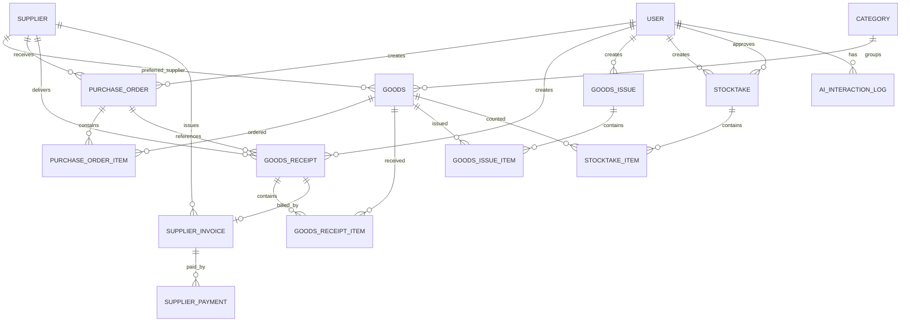

# Đề xuất đánh giá mức độ tự động hóa hệ thống

## 1. Nhận định tổng quan

Đúng, hệ thống hiện tại chưa đủ tự động và thông minh ở toàn bộ quy trình, nhưng phần quan hệ giữa các model đã được thiết kế tương đối đầy đủ.

Các model có liên kết dữ liệu với nhau thông qua khóa ngoại và SQLAlchemy relationship. Tuy nhiên, có quan hệ dữ liệu không đồng nghĩa với việc một model sẽ tự động kích hoạt nghiệp vụ của model khác.

Hiện tại hệ thống tự động hóa rõ nhất ở ba nghiệp vụ:

```text
Phiếu nhập -> tăng tồn kho
Phiếu xuất -> giảm tồn kho
Duyệt kiểm kê -> điều chỉnh tồn kho
```

## 2. Danh sách model hiện có

| Model | Vai trò |
|---|---|
| `User` | Người dùng, phân quyền và người thực hiện thao tác |
| `Supplier` | Nhà cung cấp |
| `Category` | Danh mục hàng hóa |
| `Goods` | Hàng hóa và tồn kho hiện tại |
| `PurchaseOrder` | Đơn đặt hàng |
| `PurchaseOrderItem` | Các hàng hóa trong đơn đặt hàng |
| `GoodsReceipt` | Phiếu nhập kho |
| `GoodsReceiptItem` | Các hàng hóa trong phiếu nhập |
| `GoodsIssue` | Phiếu xuất kho |
| `GoodsIssueItem` | Các hàng hóa trong phiếu xuất |
| `Stocktake` | Phiếu kiểm kê |
| `StocktakeItem` | Các hàng hóa trong phiếu kiểm kê |
| `SupplierInvoice` | Hóa đơn nhà cung cấp |
| `SupplierPayment` | Các lần thanh toán hóa đơn |
| `AIInteractionLog` | Lịch sử tương tác với AI |

## 3. Quan hệ giữa các model



## 4. Tương tác và mức độ tự động

### 4.1. User

**Có quan hệ với:**

- Đơn đặt hàng thông qua `created_by`.
- Phiếu nhập thông qua `created_by`.
- Phiếu xuất thông qua `created_by`.
- Phiếu kiểm kê thông qua `created_by` và `approved_by`.
- Nhật ký AI thông qua `user_id`.

**Có hoạt động:** lưu người tạo, người duyệt và người sử dụng AI.

**Chưa tự động:** role chỉ kiểm soát quyền truy cập, không tự tạo nghiệp vụ.

### 4.2. Supplier

**Có quan hệ với:**

- Hàng hóa thông qua nhà cung cấp ưu tiên.
- Đơn đặt hàng.
- Phiếu nhập.
- Hóa đơn nhà cung cấp.

**Có hoạt động:** xác định nhà cung cấp trong PO, phiếu nhập và hóa đơn.

**Chưa tự động:** thêm nhà cung cấp không tự tạo hàng hóa, PO hoặc phiếu nhập.

### 4.3. Category

Một danh mục có nhiều hàng hóa.

**Có hoạt động:** phân loại hàng hóa.

**Chưa tự động:** tạo danh mục không tự tạo hàng hóa.

### 4.4. Goods

**Có quan hệ với:**

- `Category`.
- `Supplier`.
- Các dòng hàng trong PO.
- Các dòng hàng trong phiếu nhập.
- Các dòng hàng trong phiếu xuất.
- Các dòng hàng trong phiếu kiểm kê.

`quantity_on_hand` là số tồn kho hiện tại.

**Có tự động:**

- Tăng khi lập phiếu nhập.
- Giảm khi lập phiếu xuất.
- Cập nhật theo số thực tế khi duyệt kiểm kê.
- Được dùng để cảnh báo dưới Min hoặc vượt tồn.

**Chưa tự động:**

- Thêm hàng hóa không tạo phiếu nhập.
- Không tự tạo tồn đầu kỳ từ nhà cung cấp.
- Không tự sinh PO.
- Chưa có bảng nhật ký biến động tồn kho riêng.

### 4.5. PurchaseOrder và PurchaseOrderItem

**Có quan hệ với:**

- Một nhà cung cấp.
- Một người tạo đơn.
- Nhiều hàng hóa thông qua `PurchaseOrderItem`.
- Các phiếu nhập có thể liên kết qua `po_id`.

**Có hoạt động:**

- Lưu hàng hóa đã đặt.
- Lưu số lượng và đơn giá dự kiến.
- Theo dõi trạng thái PO.
- Đối chiếu số lượng đặt với số lượng thực nhập khi lập phiếu nhập có `po_id`.

**Chưa tự động:**

- Tạo PO không tạo phiếu nhập.
- Khi PO chuyển từ `đang giao` sang `đã nhận`, hệ thống tự tạo phiếu xuất theo các dòng đã đặt và trừ tồn qua transaction phiếu xuất.
- Không tự sinh phiếu nhập.
- Không tự tạo hóa đơn.

### 4.6. GoodsReceipt và GoodsReceiptItem

**Có quan hệ với:**

- Nhà cung cấp.
- PO nếu nhập theo đơn đặt hàng.
- Người lập phiếu.
- Hàng hóa trong phiếu nhập.
- Một hóa đơn nhà cung cấp.

**Có tự động:**

```text
goods.quantity_on_hand += receipt_item.quantity
```

Khi lập phiếu nhập, hệ thống kiểm tra:

- Nhà cung cấp có tồn tại và đang hoạt động không.
- Hàng hóa có tồn tại và đang kinh doanh không.
- PO có tồn tại và đúng nhà cung cấp không.
- Số lượng nhận có vượt số lượng đặt không.

### 4.7. GoodsIssue và GoodsIssueItem

**Có quan hệ với:**

- Người lập phiếu.
- Hàng hóa trong phiếu xuất.

**Có tự động:**

```text
goods.quantity_on_hand -= issue_item.quantity
```

Hệ thống kiểm tra:

- Hàng hóa có tồn tại không.
- Hàng hóa còn kinh doanh không.
- Số lượng xuất có vượt tồn không.
- Không cho tồn kho âm.

**Chưa có:** liên kết trực tiếp với đơn bán hàng, bộ phận nhận hàng hoặc lệnh sản xuất.

### 4.8. Stocktake và StocktakeItem

**Có quan hệ với:**

- Thủ kho lập phiếu.
- Quản lý kho phê duyệt.
- Hàng hóa được kiểm kê.

**Có tự động:**

Khi phiếu kiểm kê được duyệt:

```text
goods.quantity_on_hand = stocktake_item.actual_quantity
```

Quy trình hiện tại là:

```text
Thủ kho lập -> Chờ phê duyệt -> Quản lý kho duyệt -> Cập nhật tồn
```

### 4.9. SupplierInvoice và SupplierPayment

**Có quan hệ với:**

- Nhà cung cấp.
- Phiếu nhập.
- Các lần thanh toán.

**Có hoạt động:**

- Liên kết hóa đơn với phiếu nhập.
- Tính số tiền đã thanh toán.
- Theo dõi công nợ và trạng thái thanh toán.

**Chưa tự động:**

- Phiếu nhập không tự sinh hóa đơn.
- Hóa đơn không làm thay đổi tồn kho.
- Thanh toán không làm thay đổi tồn kho.

### 4.10. AIInteractionLog

**Có quan hệ với:**

- Người dùng thực hiện tương tác AI.

**Có hoạt động:** lưu loại tính năng, prompt, phản hồi AI, model sử dụng và thời gian.

**Chưa tự động:** AI chưa tự tạo PO, phiếu nhập, phiếu xuất hoặc tự cập nhật tồn kho.

## 5. Những phần đã tự động

1. Lập phiếu nhập thì cộng tồn kho.
2. Lập phiếu xuất thì trừ tồn kho.
3. PO chuyển từ `đang giao` sang `đã nhận` thì tự tạo phiếu xuất và trừ tồn tương ứng.
4. Không cho xuất vượt tồn.
5. Duyệt kiểm kê thì cập nhật tồn thực tế.
6. Kiểm tra PO khi lập phiếu nhập.
7. Tính số tiền đã thanh toán từ lịch sử thanh toán.
8. Báo cáo đọc dữ liệu nhập, xuất và tồn.
9. AI phân tích tồn kho và đưa ra gợi ý.

## 6. Những phần chưa tự động

1. Thêm hàng hóa không tạo tồn đầu kỳ.
2. Tạo PO không tự tạo phiếu nhập.
3. Chưa tự sinh phiếu nhập từ PO.
4. Chưa tự sinh hóa đơn từ phiếu nhập.
5. Chưa tự cập nhật công nợ từ một chuỗi nghiệp vụ hoàn chỉnh.
6. Hàng xuống dưới Min chưa tự tạo PO.
7. AI chỉ đưa gợi ý, chưa được phép tự tạo giao dịch.
8. Chưa có model riêng ghi nhận mọi biến động tồn kho.
9. Phiếu xuất tự động từ PO hiện liên kết bằng ghi chú, chưa có khóa ngoại `po_id`.
10. Phiếu xuất chưa liên kết với bộ phận nhận, đơn bán hoặc lệnh sản xuất.

## 7. Kết luận

Hệ thống hiện tại có tự động hóa cục bộ, chủ yếu ở phần cập nhật tồn kho sau khi người dùng lập phiếu.

Chuỗi nghiệp vụ hoàn chỉnh hiện chưa tự động:

```text
Hàng xuống Min
    -> AI đề xuất
    -> Tạo PO
    -> Nhà cung cấp giao hàng
    -> Tạo phiếu nhập
    -> Tăng tồn
    -> Tạo hóa đơn
    -> Theo dõi công nợ
```

Vì vậy, hệ thống có quan hệ giữa các model nhưng chưa có đủ cơ chế để các model tự kích hoạt nghiệp vụ của nhau. Hiện tại người dùng vẫn phải chủ động nhập PO, phiếu nhập, phiếu xuất, hóa đơn và thanh toán theo từng bước.
